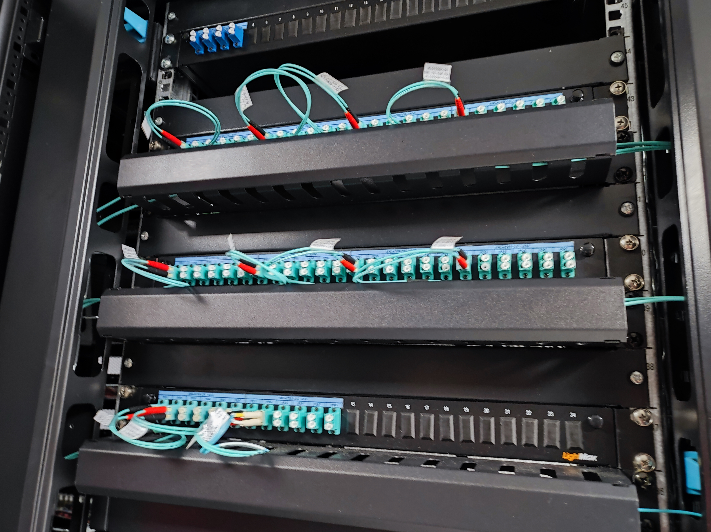
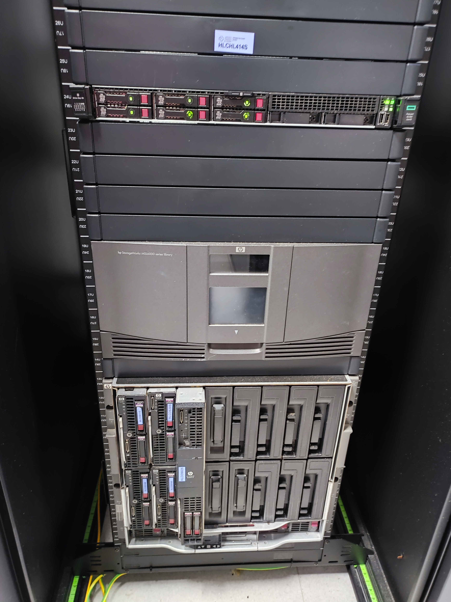
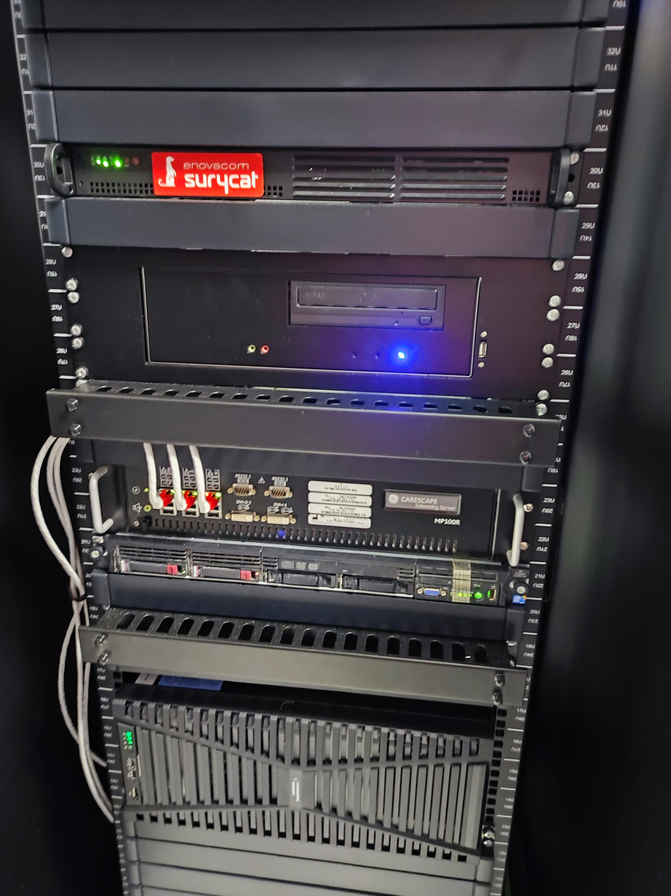

# CPD dun hospital

## SAI
Entre os elementos fundamentais dun CPD están os SAI.
SAI con baterías noutro armario

 Dous SAIs

# Carriles cables
Aínda non se colocaron os cables

Cables colocados ordenadamente 

## Tipo de cableado
Conexións de cables de fibra

Adaptador de fibra a Ethernet

## Armarios (rack)

Ordenador integrado no mesmo rack

Ordenador do rack coa pantalla visible

 Parte traseira dun rack

## Panel de parcheo (Patch Panel )
Organización do cableado nun patch panel

Detalle do etiquetado dos cables

## Routers
 Conexión aos routers

Router Huawei

## Telefonía
 Repartidor de servizos de telefoníav

Cableado coaxial

## Servidores de almacenamento
Organización dos discos de almacenamento nun rack

## Servidor de telemetría

Control da telemetría do sistema

