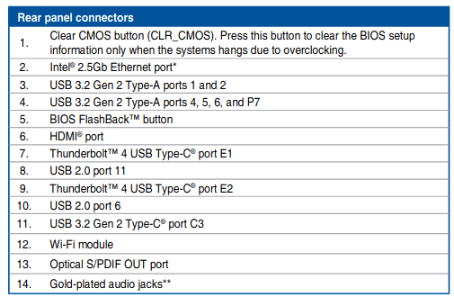

   

Para comunicarse cos [periféricos]({{site.url}}/perifericos/1per) son moitos os conectores ós que se accede polas aberturas da caixa. Os tamaños e modelos están estandárizados sendo os máis comúns:
* _PS/2_ son circulares, normalmente verdes e morados. Comunican o teclado mailo rato co ordenador. A transmisión de datos é en [serie.]({{site.url}}/codificar/10transmision)
* _USB_ é o máis usado hoxe en día. A comunicación tamén é en serie. Os catro cables que o forman empréganse dous para alimentación e dous para o intercambio de datos.
*  _Ethernet_ é o cable de rede. Emprega o formato RJ-45 para conectar ordenadores entre sí ou a traverso de [periféricos de comunicación]({{site.url}}/perifericos/60per_comunicacion)  a internet.
* _Conectores de audio,_ os máis extendidos son os mini-jack para micrófonos, altoparlantes ou auriculares.
* _Firewire_ era un porto con transmisión en [paralelo]({{site.url}}/codificar/10transmision) que permite unha alta taxa de transferencia de datos. Caseque non se usa no ámbito doméstico.
* _Conectores de vídeo_ son de varios tipos:
  - VGA é o sistema máis empregado para conectar as pantallas ós ordendores
  - DVI transmite os datos dixitalizados
  - HDMI permite o envío de audio e vídeo de alta definición

{:style="display:block; margin-left:auto; margin-right:auto"}

As placas máis modernas traen outro tipo de conectores:

{:style="display:block; margin-left:auto; margin-right:auto"}

{:style="display:block; margin-left:auto; margin-right:auto"}