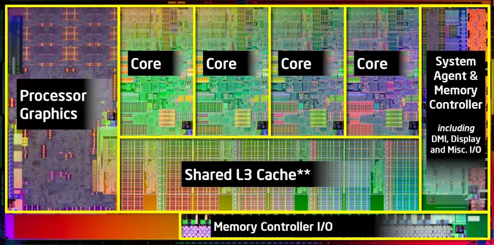

   

É a compoñente máis importante do ordenador. Hai quen di que é o verdadeiro  cerebro que controla e goberna todo o sistema.

 A CPU (central processing unit) como adoita chamarse consiste nun circuito integrado que interpreta e executa as instrucións dos programas almacenados na [memoria]({{site.url}}/memoria/09RAM).

Está formada por:

> * [unidade de control (UC)]({{site.url}}/procesador/04UC)

> * [unidade aritmético-lóxica (ALU)]({{site.url}}/procesador/03ALU)

> * [memorias caché]({{site.url}}/procesador/08cache)

> * [rexistros]({{site.url}}/procesador/10rexistros)

A potencia da CPU mídese segundo a velocidade e a cantidade de datos que é quen de procesar. Mídese en ciclos por segundo, ou millóns de ciclos por segundo, denominados _megahercios_ (MHz), ou miles de millóns de ciclos por segundo denominados _xigahercios_ (GHz).

 Os maiores fabricantes de microprocesadores son AMD e Intel e son dous os tipos de procesadores que existen no mercado. Segundo o tipo  [socket]({{site.url}}/placa/01socket) que teñamoas na placa.

 

 Entre as características máis importantes dos procesadores falaremos por exemplo da frecuencia dun procesador que se mide en Hz. É  a velocidade á que os seus pequenos transistores se activan e desactivan. A efectos prácticos, dicimos que representa a frecuencia á que o procesador pode realizar operacións: a maior frecuencia maior número de instrucións por segundo.

Para mellorar o funcionamento dos procesadores se integraron os _cores ou núcleos_ que son unidades de procesamento independente. A incorporación de varios núcleos dentro dun procesador é un dos principais motivos do aumento do rendemento dos procesadores actuais sen a necesidade de aumentar drásticamente a súa frecuencia de traballo. Na imaxe vemos un procesador con catro cores e tres niveis de [memoria caché]({{site.url}}/procesador/08cache)

